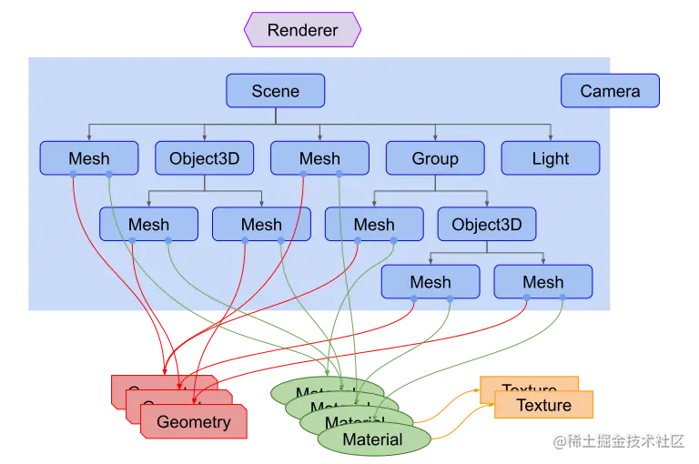
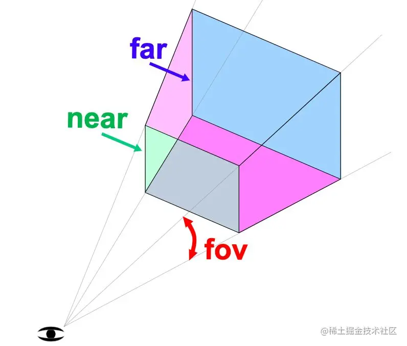
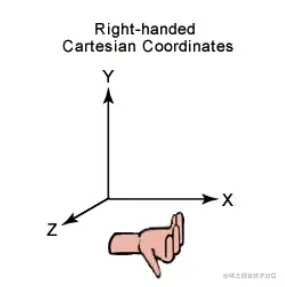

## 1. 入门



### 1.1 渲染器（renderer）

它是Three.js的主要对象，场景(Scene)和摄像机(Camera)都需要传入渲染器(Renderer)中，通过它将摄像机视椎体中的三维场景渲染成一个二维图片显示在画布上。

### 1.2 场景(scene)

它就相当于一个大容器，我们需要展示的所有物体都要放入场景。如上图所示当把其对象放入场景后形成树状结构，就组合成场景图。在场景图中子对象的位置和方向总是相对于父对象而言的，比如我移动了父对象的位置，子对象也会一起移动。

### 1.3 相机(camera)

它与其他对象不同的是，它不一定要在场景图中才能起作用，它可以和场景同级。相同的是，摄像机(Camera)作为其他对象的子对象，同样会继承它父对象的位置和朝向。Three.js内置几种摄像机：

- PerspectiveCamera 透视相机，这一投影模式被用来模拟人眼所看到的景象，它是3D场景的渲染中使用得最普遍的投影模式。

- CubeCamera 立方相机，这一投影模式显示的景象是在一个立方范围内的。
- OrthographicCamera 正交相机，在这种投影模式下，无论物体距离相机距离远或者近，在最终渲染的图片中物体的大小都保持不变。

### 1.4 几何体（Geometry）

就是球体、立方体、平面、狗、猫、人、树、建筑等物体的顶点信息。Three.js内置了许多基本几何体:

- `CubeGeometry` 立方体
- `PlaneGeometry` 平面
- `SphereGeometry` 球体
- `CylinderGeometry` 圆柱体
- `TorusGeometry` 圆环面
- `TubeGeometry` 管道缓冲几何体

### 1.5 材质（Material）

和`几何体`同时使用，表示几何体不同面的颜色，和光亮程度。`Three.js`内置了许多材质:

- `MeshBasicMaterial` 基础网格材质，不受光照的影响。
- `MeshDistanceMaterial` 通过点光源实现阴影的材质。
- `MeshNormalMaterial` 一种把法向量映射到RGB颜色的材质。

### 1.6 纹理（Texture）

创建一个纹理贴图，将其应用到一个表面，或者作为反射/折射贴图。可以多个纹理同时在一个材质上使用。

### 1.7 网格（Mesh）

需要传入几何体和材质组合为一个带有位置和方向的特殊几何体。

### 1.8 光源（Light）

和`材质`配合使用，通过不同的光源来修改颜色，添加阴影等。

- `AmbientLight` 环境光，会均匀的照亮场景中的所有物体。
- `DirectionalLight` 平行光，是沿着特定方向发射的光。
- `HemisphereLight` 半球光，光源直接放置于场景之上，光照颜色从天空光线颜色渐变到地面光线颜色。不可以投射阴影。
- `PointLight` 点光源，从一个点向各个方向发射的光源。可以投射阴影。

### 1.9 代码

```vue
<template>
    <div>
        <canvas ref="container"></canvas>
    </div>
</template>

<script setup>
import * as THREE from 'three';
import { onMounted, ref } from 'vue';

const container = ref(null);

onMounted(() => {
    // 渲染器
    const renderer = new THREE.WebGLRenderer({ canvas: container.value });
    // 创建透视相机
    const fov = 40 // 视野范围
    const aspect = 2 // 相机默认值 画布的宽高比
    const near = 0.1 // 近平面
    const far = 1000 // 远平面
    // 透视投影相机
    const camera = new THREE.PerspectiveCamera(fov, aspect, near, far)

    // 相机位置  正上方向下看
    camera.position.set(0, 50, 0)// 相机位置
    camera.up.set(0, 0, 1)
    camera.lookAt(0, 0, 0) // 相机朝向

    // 创建场景
    const scene = new THREE.Scene()
    // 创建光源，并加入场景。
    const color = 0xffffff;
    const intensity = 3
    const light = new THREE.PointLight(color, intensity)
    // 光源 加入场景
    scene.add(light)
    // 创建网格，并加入场景。
    // 球体
    const radius = 2 // 半径
    const widthSegments = 1 // 经度上的切片数
    const heightSegments = 1 // 纬度上的切片数
    // 创建球体
    const sphereGeometry = new THREE.SphereGeometry(radius, widthSegments, heightSegments)
    // 材质 emissive 不被光影响的颜色
    // MeshPhongMaterial 一种用于具有镜面高光的光泽表面的材质。
    const sunMaterial = new THREE.MeshPhongMaterial({ color: 0x44aa88, emissive: 0xffff00 })
    // 网格
    const sunMesh = new THREE.Mesh(sphereGeometry, sunMaterial)
    sunMesh.position.x = 10
    scene.add(sunMesh)

    function render(time) {
        time *= 0.001

        sunMesh.rotation.y = time
        sunMesh.rotation.x = time

        // 加载渲染器
        renderer.render(scene, camera)

        // 开始动画
        requestAnimationFrame(render)
    }

    // 开始渲染
    requestAnimationFrame(render)

})
</script>

<style lang="scss" scoped>
div{
    height: 100%;
    canvas{
        height: 100%;
        width: 100%;
    }
}
</style>
```


## 2. 渲染器

WebGLRenderer主要作用就是把相机视椎体中的三维场景渲染成一个二维图片显示在画布上。实例化new WebGLRenderer()接受一个对象参数作为渲染器的行为配置。不传参数都会执行其默认值。常用配置：

- canvas 与渲染器绑定的画布节点。不传内部会自己创建一个新的画布节点，使用.domElement获取。

- context 渲染上下文(RenderingContext) 对象。就是将渲染器附加到已经创建的WebGL上下文中以便后期操作。默认为null
- precision 着色器精度。渲染成图片的颜色精度。值：highp/mediump/lowp默认为highp。
- alpha 是否可以设置背景色透明。默认为false。
- antialias 是否执行抗锯齿。默认为false。
- preserveDrawingBuffer 是否保留缓直到手动清除或被覆盖。 默认false。

除了实例化的默认配置，我们也可以通过它的属性来控制渲染器。常用属性：

- .autoClear 定义渲染器是否在渲染每一帧之前自动清除其输出。

- .autoClearColor 定义渲染器是否需要清除颜色缓存。默认为true。
- .autoClearDepth 定义渲染器是否清除深度缓存。 默认是true。
- .autoClearStencil 定义渲染器是否需要清除模板缓存。默认为true。
- .domElement 返回画布节点。当配置参数没关联canvas，会自动创建一个新的画布节点，需要手动放入html中。
- .shadowMap 是一个对象。当我们需要阴影时就需要开启它。
- .shadowMap.enabled  是否允许在场景中使用阴影贴图，默认false。
- .shadowMap.autoUpdate 是否启动场景中的阴影自动更新，默认是true。
- .shadowMap.type 值是Integer类型，定义阴影贴图类型。可选值有THREE.BasicShadowMap, THREE.PCFShadowMap (默认), THREE.PCFSoftShadowMap 和 THREE.VSMShadowMap THREE全局常量值，代表不同的数字。

有了参数和属性的控制就还有方法的控制。常用方法：

- .clear(color:Boolean, depth:Boolean, stencil:Boolean ) 渲染器清除颜色、深度或模板缓存。

- .getContext() 返回WebGL上下。
- .render()(scene,camera) 传入场景和相机，在画布上渲染图片。
- .setClearColor(color,alpha) 设置背景颜色和透明度。
- .setSize()( width,height) 修改canvas节点的宽高。

```js
// 渲染器 实例化
const renderer = new THREE.WebGLRenderer()
// 设置 画布宽高
renderer.setSize(1000, 500)
// 加入html
document.body.appendChild(renderer.domElement)
// 获取上下文
console.log('getContext()', renderer.getContext())
// 设置背景颜色和透明度
renderer.setClearColor(0xeeeeee, 0.5)
```

渲染器(WebGLRenderer) 简单理解就是，把我们绘制的场景图，通过相机视椎体的范围来截取，转化为一张图片。然后去绑定页面上canvas元素把这张图片绘制到元素上。动画效果就是不断的生成新的图片替换原来的图片来实现的。渲染器上有很多属性和方法，都是配合其他内容一起使用的，比如阴影就需要灯光和几何体来配合才能展示。

## 3.  透视相机

在three.js中，摄像机的作用就是不断的拍摄我们创建好的场景，然后通过渲染器渲染到屏幕中。想通过不同的角度观看场景，就需要修改摄像机的位置来拍摄场景。本文详细介绍的是透视相机（PerspectiveCamera） 它是用来模拟人眼所看到的景象，它也是3D场景的渲染中使用得最普遍的投影模式。

 **透视相机**

根据视锥的范围给渲染器提供需要渲染的场景范围。
实例化new THREE.PerspectiveCamera() 接受4个参数来确认视锥的范围。只要在视锥范围内的场景才会渲染。

1. 
   fov  摄像机视锥体垂直视野角度。

2. aspect  摄像机视锥体长宽比。
3. near  摄像机视锥体近端面。
4. far  摄像机视锥体远端面。



- 大多数属性发生改变之后，都需要调用`.updateProjectionMatrix()`来使得这些改变生效。
- 常见属性：
  1. `.fov、.aspect、.near、.far` 后期可修改这四个参数，来实现动画效果。
  2. `.zoom` 获取或者设置摄像机的缩放倍数，默认值为`1`

**常见方法**

- .setViewOffset() 设置偏移量，对于多窗口或者多显示器的设置是很有用的。

- .clearViewOffset() 清除任何由.setViewOffset()设置的偏移量。
- .getEffectiveFOV() 结合.zoom（缩放倍数），以角度返回当前垂直视野角度。
- .updateProjectionMatrix() 更新摄像机投影矩阵。在任何参数被改变以后必须被调用。

**位置**

- `.position` 设置相机在三维坐标中的位置。

```js
camera.position.set(0,0,0);
```

- `.up` 设置相机拍摄时相机头顶的方向。

```js
camera.up.set(0,1,0);
```

- `.lookAt` 设置相机拍摄时指向的方向。

```js
camera.lookAt(0, 0, 0);
```

## 4. 使用GUI

- 为了能够快速地搭建three.js的交互UI，社区就出现了各种UI 库，其中lil-gui 是 three.js社区中非常流行的 UI 库。选择它是因为语法简单，上手快。

- 主要作用，获取一个对象和该对象上的属性名，并根据属性的类型自动生成一个界面组件来操作该属性。
- 使用它后，我们可以通过界面组件来控制场景中的物体，提高调试效率。

**常用的方法**

- .add() 将控制器添加到GUI，使用typeof运算符推断控制器类型。
- .addColor() 将颜色控制器添加到GUI。
- .addFolder() 以层级的形式创建一个新的GUI。

```vue
<template>
  <div>
    <canvas ref="container"></canvas>
  </div>
</template>

<script setup>
import { onMounted, ref } from 'vue';
import dat from 'dat.gui';
import THREE from '@/global/three';
const container = ref(null);

const gui = new dat.GUI();


onMounted(() => {
  const clock = new THREE.Clock();
  // 渲染器
  const renderer = new THREE.WebGLRenderer({ canvas: container.value, antialias: true });
  const fov = 40 // 视野范围
  const aspect = 2 // 相机默认值 画布的宽高比
  const near = 0.1 // 近平面
  const far = 1000 // 远平面
  // 透视投影相机
  const camera = new THREE.PerspectiveCamera(fov, aspect, near, far)
  camera.position.set(0, 10, 20)
  camera.lookAt(0, 0, 0)
  // 控制相机
  const controls = new THREE.CameraControls(camera, container.value)

  // 使用GUI控制相机
  function updateCamera() {
    camera.updateProjectionMatrix()
  }
  gui.add(camera, 'fov', 1, 80).onChange(updateCamera)
  gui.add(camera, 'near', 1, 200).onChange(updateCamera)
  gui.add(camera, 'far', 1, 200).onChange(updateCamera)

  class PositionGUI {
    constructor(obj, name) {
      this.obj = obj
      this.name = name
    }
    get modify() {
      return this.obj[this.name]
    }
    set modify(v) {
      this.obj[this.name] = v
    }
  }
  const folder = gui.addFolder('全局Position')
  folder.add(new PositionGUI(camera.position, 'x'), 'modify', 0, 200).name('x')
  folder.add(new PositionGUI(camera.position, 'y'), 'modify', 0, 200).name('y')
  folder.add(new PositionGUI(camera.position, 'z'), 'modify', 0, 200).name('z')

  // 场景
  const scene = new THREE.Scene()
  scene.background = new THREE.Color('black')

  // 地面
  const planeSize = 20;
  // 加载纹理
  const loader = new THREE.TextureLoader();
  const texture = loader.load('https://threejs.org/manual/examples/resources/images/checker.png')
  texture.wrapS = THREE.RepeatWrapping
  texture.wrapT = THREE.RepeatWrapping
  texture.magFilter = THREE.NearestFilter
  const repeats = planeSize / 2
  texture.repeat.set(repeats, repeats)
  // 创建二维平面作为地面
  const planGeo = new THREE.PlaneGeometry(planeSize, planeSize)
  const planeMat = new THREE.MeshPhongMaterial({
    map: texture,
    side: THREE.DoubleSide
  })
  const mesh = new THREE.Mesh(planGeo, planeMat);
  mesh.rotation.x = Math.PI * -0.5
  scene.add(mesh)

  // 立方体
  const cubeSize = 4
  const cubeGeo = new THREE.BoxGeometry(cubeSize, cubeSize, cubeSize)
  const cubeMat = new THREE.MeshPhongMaterial({ color: '#8f4b2e' })
  const cubMesh = new THREE.Mesh(cubeGeo, cubeMat)
  cubMesh.position.y = 2
  scene.add(cubMesh)


  // 灯光
  const color = 0xffffff
  const intensity = 1
  // 方向光
  const light = new THREE.DirectionalLight(color, intensity)
  light.position.set(0, 10, 0)
  light.target.position.set(-5, 0, 0)
  scene.add(light)
  scene.add(light.target)


  //  渲染
  function render() {
    const delta = clock.getDelta();
    controls.update(delta)
    renderer.render(scene, camera)
    requestAnimationFrame(render)
  }

  requestAnimationFrame(render)
})
</script>

<style lang="scss" scoped>
div {
  height: 100%;

  canvas {
    height: 500px;
    width: 1000px;
  }
}
</style>
```

## 5. 几何体

- 在three.js中如球体、立方体、平面、狗、猫、人、树、建筑等物体，都是几何体。它们都是根据大量顶点参数生成。

- 在three.js中内置了许多基本几何体，也提供了自定义几何体的方法。在开发中常见的做法是让美术在 3D 建模软件中创建 3D 模型，在由开发人员进行交互开发。

**BoxGeometry 盒子**

分段数简单理解，就是每多一个分段，在对应面的轴上添加两个顶点，增加组成这个面三角形的数量。分段数越多面就越精细，性能消耗也会变大。

**SphereGeometry 球**

SphereGeometry是通过扫描并计算围绕着Y轴和X轴的顶点来创建的。我们可以通过修改水平、垂直扫描角度的大来实现球体切片。

**BufferGeometry 自定义几何体**

- BufferGeometry是面片、线或点几何体的有效表述。通过顶点位置、法相量、颜色值、UV 坐标等值来绘制几何体
- 使用BufferGeometry可以有效减少向 GPU 传输顶点数据所需的开销。
  - 定义面的顶点位置，法线坐标（法线是面朝向的信息）。一个面是两个三角形组成，所以需要6个顶点，一个立方体就需要36个顶点信息。
  - 通过.setAttribute()设置定义好的顶点信息。这里需要注意的是.BufferAttribute()第二个参数是确认，数组中连续的几个值组合为一组信息。
- 自定义几何体的优势是它和GPU传输的数度快，缺点是顶点信息难以修改，在开发中需要根据需求判断是否使用。

```vue
<template>
  <div>
    <canvas ref="container"></canvas>
  </div>
</template>

<script setup>
import { onMounted, ref } from 'vue';
import THREE from '@/global/three';
const container = ref(null);

onMounted(() => {
  const clock = new THREE.Clock();
  // 渲染器
  const renderer = new THREE.WebGLRenderer({ canvas: container.value, antialias: true });
  const fov = 40 // 视野范围
  const aspect = 2 // 相机默认值 画布的宽高比
  const near = 0.1 // 近平面
  const far = 1000 // 远平面
  // 透视投影相机
  const camera = new THREE.PerspectiveCamera(fov, aspect, near, far)
  camera.position.set(0, 10, 20)
  camera.lookAt(0, 0, 0)
  // 控制相机
  const controls = new THREE.CameraControls(camera, container.value)

  // 场景
  const scene = new THREE.Scene()
  scene.background = new THREE.Color('black')

  // 立方体
  {
    const width = 8 // 宽度
    const height = 8 // 高度
    const depth = 8 // 深度
    const widthSegments = 4 // ui: 宽度的分段数
    const heightSegments = 4 // ui: 高度的分段数
    const depthSegments = 4 // ui: 深度的分段数
    const boxGeometry = new THREE.BoxGeometry(width, height, depth, widthSegments, heightSegments, depthSegments)
    const boxMat = new THREE.MeshPhongMaterial({ color: '#8f4b2e' })
    const boxMesh = new THREE.Mesh(boxGeometry, boxMat)
    boxMesh.position.y = 2
    scene.add(boxMesh)
  }

  const material =  new THREE.MeshPhongMaterial({ color: '#8f4b2e' })
  {
    const radius = 2 // 球体半径
    const widthSegments = 32 // 水平分段数
    const heightSegments = 16 // 垂直分段数
    const geometry = new THREE.SphereGeometry(radius, widthSegments, heightSegments)

    // 网格
    const mesh = new THREE.Mesh(geometry, material)
    mesh.position.x = 10
    scene.add(mesh)
  }

  // 圆环
  {
    const radius = 2 // 球体半径
    const widthSegments = 32 // 水平分段数
    const heightSegments = 16 // 垂直分段数
    const phiStart = Math.PI * 0.25 // 水平（经线）起始角度
    const phiLength = Math.PI * 2 // 水平（经线）扫描角度的大小
    const thetaStart = Math.PI * 0.25 // 垂直（纬线）起始角度
    const thetaLength = Math.PI * 0.5 // 垂直（纬线）扫描角度大小
    const geometry1 = new THREE.SphereGeometry(
      radius,
      widthSegments,
      heightSegments,
      phiStart,
      phiLength,
      thetaStart,
      thetaLength
    )

    // 网格
    const mesh1 = new THREE.Mesh(geometry1, material)
    mesh1.position.x = -10
    scene.add(mesh1)
  }

  // 灯光
  const color = 0xffffff
  const intensity = 1
  // 方向光
  const light = new THREE.DirectionalLight(color, intensity)
  light.position.set(0, 10, 0)
  light.target.position.set(-5, 0, 0)
  scene.add(light)
  scene.add(light.target)

  // 环境光
  const ambientLight = new THREE.AmbientLight(0x404040); // 设置环境光的颜色
  scene.add(ambientLight);


  //  渲染
  function render () {
    const delta = clock.getDelta();
    controls.update(delta)
    renderer.render(scene, camera)
    requestAnimationFrame(render)
  }

  requestAnimationFrame(render)
})
</script>

<style lang="scss" scoped>
div {
  height: 100%;

  canvas {
    height: 500px;
    width: 1000px;
  }
}
</style>
```

## 6.  材质

- 材质简单理解就是设置几何体各个面的颜色。但它不是单纯的颜色，它能模拟在不同光照下颜色的表现。比如太阳光照射光滑的物体，表面会出现白色的反光，都能模拟。

- 材质和渲染器无关，在开发中定义一份材质就可以重复使用。

- 定义材质的常用的方式有两种:

  - 在实例化时传入要配置的参数。

    ```js
    const material = new THREE.MeshPhongMaterial({
          color: 0xFF0000, // 也可以使用CSS的颜色字符串
    });
    ```

  - 通过材质的方法设置属性。

    ```js
    const material = new THREE.MeshPhongMaterial();
    material.color.setHSL(0, 1, 0.5); 
    material.color.set(0x00FFFF); // 同 CSS的 #RRGGBB 风格
    ```

### 6.1 MeshBasicMaterial 基础材质

- 以简单着色的方式实现。
- 不受灯光的影响。

```js
const color = 0xeeeeee
const intensity = 1
// 创建光源
const light = new THREE.DirectionalLight(color, intensity)
// 光源 加入场景
scene.add(light)

// 基础材质
const material = new THREE.MeshBasicMaterial({ color: 0x44aa88 })
// 网格
const mesh = new THREE.Mesh(sphereGeometry, material)
mesh.position.x = 10
scene.add(mesh)

// 基础材质
const material2 = new THREE.MeshBasicMaterial({ color: 0x44aa88, wireframe: true })
// 网格
const mesh2 = new THREE.Mesh(sphereGeometry, material2)
mesh2.position.x = 0
scene.add(mesh2)
```

- wireframe 基础材质的属性，设置true，只渲染线框。
- 创建球几何体使用基础材质，和平面没区别。
- 通常用于显示几何体线框时使用。

### 6.2 MeshLambertMaterial Lambert网格材质

- 表面光滑的材质。
- 受灯光的影响，不过只在顶点计算光照。
- 能很好的模拟一些表面（例如未经处理的木材或石材）。因为只在顶点计算光照，不能模拟具有镜面高光的表面（如地板砖这些）。

```js
const material = new THREE.MeshLambertMaterial({ color: 0x44aa88 })
// 网格
const mesh = new THREE.Mesh(sphereGeometry, material)
mesh.position.x = 5
scene.add(mesh)
```

emissive是材质的属性，用于设置材质发出的颜色，这种颜色不受光照影响。

### 6.3 MeshPhongMaterial Phong网格材质

- 具有镜面高光的材质。
- 每个像素都会计算光照。
- 模拟具有镜面高光的表面（如地板砖）。

```js
const material = new THREE.MeshPhongMaterial({ color: 0x44aa88 })
// 网格
const mesh = new THREE.Mesh(sphereGeometry, material)
mesh.position.x = 5
scene.add(mesh)
```

shininess属性，决定高光的光泽，值越大光泽越亮。默认是30。

## 7. 纹理

- 简单理解`纹理`就是一张图片，它是由像素点组成。
- 在`three.js`一般都是使用在材质上，和配置颜色一样。**颜色**是材质表面所有的像素都是同一个颜色，**纹理**是根据配置信息在材质表面显示纹理（贴图）不同位置的像素点。

### 7.1 创建纹理

```js
// 立体几何
const boxWidth = 4
const boxHeight = 4
const boxDepth = 4
const geometry = new THREE.BoxGeometry(boxWidth, boxHeight, boxDepth)

const loader = new THREE.TextureLoader()
// 基础材质
const material = new THREE.MeshBasicMaterial({
    map: loader.load( 			                                'https://gimg2.baidu.com/image_search/src=http%3A%2F%2Fpic.16pic.com%2F00%2F07%2F46%2F16pic_746871_b.jpg'
    )
})
// 网格
const mesh = new THREE.Mesh(geometry, material)
mesh.position.x = 5
scene.add(mesh)
```

- 使用`.TextureLoader()`加载图片，转化为纹理，通过属性`map`设置材质纹理。就实现了简单的纹理加载。
- 需要注意`.TextureLoader()`是异步的，当几何绘制先执行完，几何体是不会有纹理的。

### 7.2 加载纹理方式

- 简单加载。

  ```js
   const texture = loader.load('https://gimg2.baidu.com/image_search/src=http%3A%2F%2Fpic.16pic.com%2F00%2F07%2F46%2F16pic_746871_b.jpg');
  ```

- 等待纹理加载完成。loader.load()的第二个参数是个回调函数，当纹理加载完后执行。

  ```js
  const loader = new THREE.TextureLoader()
  let mesh = null
  loader.load( 'https://gimg2.baidu.com/image_search/src=http%3A%2F%2Fpic.16pic.com%2F00%2F07%2F46%2F16pic_746871_b.jpg',
      (texture) => {
        // 基础材质
        const material = new THREE.MeshBasicMaterial({
          map: texture
        })
        // 网格
        mesh = new THREE.Mesh(geometry, material)
        mesh.position.x = 5
        scene.add(mesh)
      }
  )
  ```

### 7.3 重复

1. 设置重复的方式需要属性.wrapS水平包裹、.wrapT垂直包裹。对应纹理UV映射中UV。

   ```js
   // THREE.js 中的常量
   // THREE.ClampToEdgeWrapping 每条边上的最后一个像素无限重复
   // THREE.RepeatWrapping      纹理重复
   // THREE.MirroredRepeatWrapping 在每次重复时将进行镜像
   texture.wrapS = THREE.RepeatWrapping;
   texture.wrapT = THREE.RepeatWrapping;
   ```

2. 设置水平和垂直重复的次数是用.repeat。

   ```js
   // 水平
   texture.repeat.x = 4;
   // 垂直
   texture.repeat.y = 4;
   ```

### 7.4 偏移

1. 设置水平和垂直的偏移需要使用`.offset`。

2. 需要注意这里的1个单位=1个纹理大小，换句话说，0 = 没有偏移，1 = 偏移一个完整的纹理数量。

   ```js
   // 水平
   texture.offset.x = 0.5;
   // 垂直
   texture.offset.y = 0.5;
   ```

### 7.5 旋转

1. 设置纹理的旋转需要两个属性，以弧度为单位的 `.rotation` 以及设置旋转中心点的`.center`。
2. `.center`单位也是1个单位=1个纹理大小。

```js
// 水平
texture.center.x = 0.5;
// 垂直
texture.center.y = 0.5;
// 旋转弧度
texture.rotation = THREE.MathUtils.degToRad(45);
```

## 8. 网格

- 表示基于以三角形组合成的几何体的类。
- three.js中几何体是不能直接渲染的。在three.js有一种类型物体，这种类型放入场景中才能直接渲染图形。网格（Mesh）是这种类型中的一种。

### 8.1 创建使用

构造参数new THREE.Mesh( geometry, material )

- geometry 几何体实例。
- material 一个材质(material)或多个材质(material)，多个材质对应几何体的各个面。

```js
 // 立体几何
const boxWidth = 6
const boxHeight = 6
const boxDepth = 6
const geometry = new THREE.BoxGeometry(boxWidth, boxHeight, boxDepth)

const loader = new THREE.TextureLoader()
const texture = loader.load(
'https://gimg2.baidu.com/image_search/src=http%3A%2F%2Fpic.16pic.com%2F00%2F07%2F46%2F16pic_746871_b.jpg'
)

// 基础材质
const material = new THREE.MeshBasicMaterial({
    map: texture
})

// 网格
const mesh = new THREE.Mesh(geometry, material)
mesh.position.x = 5
scene.add(mesh)
```

### 8.2 位置、缩放、旋转

因为网格(Mesh)的基类是.Object3D。因此包含scale、rotation、position三个属性，设置网站在场景中的位置。

- .position网格相对于父级坐标的位置。

  ```js
  mesh.position.x = x
  mesh.position.y = y
  mesh.position.z = z
  ```

- .rotation 围绕x、y、z轴旋转的弧度，需注意是弧度值。

  ```js
  mesh.rotation.x = x
  mesh.rotation.y = y
  mesh.rotation.z = z
  ```

- .scale 在x、y、z轴缩放的大小。

  ```js
  mesh.scale.x = x
  mesh.scale.y = y
  mesh.scale.z = z
  ```

### 8.3 使用多个材质

```js
const loader = new THREE.TextureLoader()
const texture = loader.load( 'https://gimg2.baidu.com/image_search/src=http%3A%2F%2Fpic.16pic.com%2F00%2F07%2F46%2F16pic_746871_b.jpg'
)
const texture2 = loader.load(
'https://img2.baidu.com/it/u=363752184,2041904643&fm=253&fmt=auto&app=138&f=JPEG?w=747&h=500'
)
// 基础材质
const material = new THREE.MeshBasicMaterial({
    map: texture
})
const material2 = new THREE.MeshBasicMaterial({
    map: texture2
})
// 网格
const mesh = new THREE.Mesh(geometry, [material, material, material, material, material, material2])
```

- 通过网格的第二个参数，传入多个材质就能实现。
- 并不是所有的几何体类型都支持多种材质，立方体可以使用6种材料，每个面一个。圆锥体可以使用2种材料，一种用于底部，一种用于侧面。

### 8.4 网格组

在物体类中有一个组（Group）对象。使用.add()方法将网格加入到组。用于同时操作网格组在场景中的坐标。

```js
const group = new THREE.Group()
group.add(sphere)
group.add(cube)
scene.add(group)
```

1. 在使用了组后。我们修改组的位置、缩放、旋转，是会同步到子对象的，他们被视为一个整体。当我们单独修改**网格对象**时，它的位置、缩放、旋转，都是相对于其父对象所在位置上进行变化。
2. 我们通常说的，全局坐标就是场景的坐标，相对坐标是其父对象的坐标。

```js
// 网格
const mesh = new THREE.Mesh(geometry, material)
// 相对坐标 x 移动5
mesh.position.x = 5

const mesh2 = new THREE.Mesh(geometry, material)
// 相对坐标 z 移动-10
mesh2.position.z = -10

const group = new THREE.Group()
group.add(mesh)
group.add(mesh2)

// 全局坐标x 移动10
group.position.x = 10
scene.add(group)
```

## 9. 光源

为了模拟物体在不同情况下的样式，three.js中提供了多种光源。需要注意光源和材质是相互的，简单来说物体表面的颜色是光源和材质的乘积。在材质中的基础材质是不受灯光影响的。

**使用Phong材质，在没有灯光的情况下，渲染的物体都是黑色。**

### 9.1 环境光 AmbientLight

- 只是简单地将材质的颜色与光源颜色进行相乘，再乘以光照强度。所以只使用环境光，场景内的物体看起来没有立体感。
- 环境光，它没有方向，无法产生阴影，场景内任何一点受到的光照强度都是相同的。

```js
const color = 0xffffff
const intensity = 1
const light = new THREE.AmbientLight(color, intensity)
scene.add(light)
```

### 9.2 半球光 HemisphereLight

- 颜色是从天空到地面两个颜色之间的渐变，与物体材质的颜色相乘后得到最终的颜色效果。
- 一般都是与其他光源一起使用。

```js
const skyColor = 0xb1e1ff // 天空 蓝色
const groundColor = 0xffffff // 地面白色
const intensity = 1
const light = new THREE.HemisphereLight(skyColor, groundColor, intensity)
scene.add(light)
```

### 9.3 方向光 DirectionalLight

- 方向光表示的是来自一个方向上的光，并不是从某个点发射出来的，而是从一个无限大的平面内，发射出全部相互平行的光线。
- 一般用于模仿太阳光。

```js
const color = 0xffffff
const intensity = 1
const light = new THREE.DirectionalLight(color, intensity)
light.position.set(0, 10, 10)
scene.add(light)

// 光源辅助线
const helper = new THREE.DirectionalLightHelper(light)
scene.add(helper)
```

### 9.4 点光源 PointLight

- 表示的是从一个点朝各个方向发射出光线的一种光照效果。
- 一般用于模拟电灯。
- 使用`.PointLightHelper()`生成点光源辅助线。

```js
const color = 0xffffff
const intensity = 1
const light = new THREE.PointLight(color, intensity)
light.position.set(0, 5, 10)
scene.add(light)

// 光源辅助线
const helper = new THREE.PointLightHelper(light)
scene.add(helper)
```

### 9.5 光源强度

- 在`WebGLRenderer`中有一个设置项 `.physicallyCorrectLights`。开启后可设置随着离光源的距离增加光照如何减弱。点光源和聚光灯等灯光受其影响。
- 在光源上有两个属性。`.power`以"流明（光通量单位）"为单位的光功率,`.decay`沿着光照距离的衰退量，默认值1。

```js
renderer.physicallyCorrectLights = true

// 点光源修改
light.power = 800
light.decay = 2
```

```vue
<template>
  <div>
    <canvas ref="container"></canvas>
  </div>
</template>

<script setup>
import { onMounted, ref } from 'vue';
import THREE from '@/global/three';
const container = ref(null);

onMounted(() => {
  const clock = new THREE.Clock();
  // 渲染器
  const renderer = new THREE.WebGLRenderer({ canvas: container.value, antialias: true });
  const fov = 40 // 视野范围
  const aspect = 2 // 相机默认值 画布的宽高比
  const near = 0.1 // 近平面
  const far = 1000 // 远平面
  // 透视投影相机
  const camera = new THREE.PerspectiveCamera(fov, aspect, near, far)
  camera.position.set(0, 10, 20)
  camera.lookAt(0, 0, 0)
  // 控制相机
  const controls = new THREE.CameraControls(camera, container.value)

  // 场景
  const scene = new THREE.Scene()
  scene.background = new THREE.Color('black')

  {
    // 地面 平铺
    const planeSize = 20
    const loader = new THREE.TextureLoader()
    const texture = loader.load('https://threejs.org/manual/examples/resources/images/checker.png')
    // THREE.RepeatWrapping 纹理重复
    texture.wrapS = THREE.RepeatWrapping
    texture.wrapT = THREE.RepeatWrapping
    // 当一个纹素覆盖大于一个像素时，贴图将如何采样。 THREE.NearestFilter，它将使用最接近的纹素的值。
    texture.magFilter = THREE.NearestFilter
    const repeats = planeSize / 2
    // 重复次数
    texture.repeat.set(repeats, repeats)
    const planeGeo = new THREE.PlaneGeometry(planeSize, planeSize)
    // Phong材质
    const planeMat = new THREE.MeshPhongMaterial({
      map: texture,
      side: THREE.DoubleSide
    })
    const mesh = new THREE.Mesh(planeGeo, planeMat)
    mesh.rotation.x = Math.PI * -0.5
    scene.add(mesh)
  }


  // 立方体
  const boxGeometry = new THREE.BoxGeometry(8, 8, 8, 4, 4, 4)
  const boxMat = new THREE.MeshPhongMaterial({ color: '#8f4b2e' })
  const boxMesh = new THREE.Mesh(boxGeometry, boxMat)
  boxMesh.position.y = 2
  scene.add(boxMesh)

  {
    // 环境光
    const ambientLight = new THREE.AmbientLight(0x404040); // 设置环境光的颜色
    scene.add(ambientLight);
  }

  // {
  //   // 半球光
  //   const skyColor = 0xb1e1ff // 天空 蓝色
  //   const groundColor = 0xffffff // 地面白色
  //   const intensity = 1
  //   const light = new THREE.HemisphereLight(skyColor, groundColor, intensity)
  //   scene.add(light)
  // }

  // {
  //   // 方向光
  //   const color = 0xffffff
  //   const intensity = 1
  //   const light = new THREE.DirectionalLight(color, intensity)
  //   light.position.set(0, 10, 10)
  //   scene.add(light)

  //   // 光源辅助线
  //   const helper = new THREE.DirectionalLightHelper(light)
  //   scene.add(helper)
  // }
  renderer.physicallyCorrectLights = true
  {
  // 点光源 PointLight
    const color = 0xffffff
    const intensity = 1
    const light = new THREE.PointLight(color, intensity)
    light.position.set(0, 5, 10)
    light.power = 800
    light.decay = 2
    scene.add(light)

    // 光源辅助线
    const helper = new THREE.PointLightHelper(light)
    scene.add(helper)
  }


  //  渲染
  function render () {
    const delta = clock.getDelta();
    controls.update(delta)
    renderer.render(scene, camera)
    requestAnimationFrame(render)
  }

  requestAnimationFrame(render)
})
</script>

<style lang="scss" scoped>
div {
  height: 100%;

  canvas {
    height: 500px;
    width: 1000px;
  }
}
</style>
```

## 10. 场景

- 在`three.js`中使用的是右手坐标系，原因是`webGL`默认的就是这种坐标系。
- 简单理解就是，**x轴正方向向右，y轴正方向向上，z轴正方向由屏幕从里向外**。
- 在场景中所有的物体在容器的位置都是依靠这个坐标系设置的。



**常用属性**

- `.background` 设置场景的背景。
- `.fog` 控制场景中的每个物体的雾的类型。
- `.environment` 设置场景中没有纹理物体的默认纹理，如物体有纹理不会修改其纹理。
- `.children` 返回场景的所有子对象。

**常用方法**

- .add() 添加对象。

- .remove() 删除已添加对象。
- .getObjectByName(name,recursive) 在创建对象时可以指定唯一的标识name，使用该方法可以查找特定名字的对象。recursive布尔对象，false：子元素上查找。true：所有后代对象上查找。

## 11. 模拟太阳、地球、月亮的运动

### 11.1 布置基础场景

```js
 const renderer = new THREE.WebGLRenderer({ canvas: container.value, antialias: true });
  renderer.setPixelRatio(window.devicePixelRatio);
  renderer.precision = 'highp';
  // 检查设备的像素比例
  const pixelRatio = window.devicePixelRatio || 1;

  const fov = 40 // 视野范围
  const aspect = 2 // 相机默认值 画布的宽高比
  const near = 0.1 // 近平面
  const far = 1000 // 远平面
  // 透视投影相机
  const camera = new THREE.PerspectiveCamera(fov, aspect, near, far)
  camera.position.set(0, 10, 50)
  camera.up.set(0, 0, 1)
  camera.lookAt(0, 0, 0)
  // 场景
  const scene = new THREE.Scene()
  const loader = new THREE.TextureLoader()
  const bgTexture = loader.load(bg);
  bgTexture.minFilter = THREE.LinearFilter; // 设置纹理过滤方式，避免模糊
  scene.background = bgTexture;

  {
    const color = 0xffffff
    const intensity = 1
    // 创建光源
    const light = new THREE.PointLight(color, intensity)
    // 光源 加入场景
    scene.add(light)
  }


  // 设置渲染器的像素比例
  renderer.setPixelRatio(pixelRatio);
  //  渲染
  function render () {
    renderer.render(scene, camera)
    requestAnimationFrame(render)
  }
requestAnimationFrame(render)
```

### 11.2 添加太阳

```js
 // 物体网格对象
const objects = []
{
    const radius = 2
    const widthSegments = 36
    const heightSegments = 36
    const sphereGeometry = new THREE.SphereGeometry(radius, widthSegments, heightSegments)

    // 太阳
    const sunTexture = loader.load('../img/1.jpg')
    const sunMaterial = new THREE.MeshBasicMaterial({ map: sunTexture })
    const sunMesh = new THREE.Mesh(sphereGeometry, sunMaterial)
    // 放大3倍
    sunMesh.scale.set(3, 3, 3)
    scene.add(sunMesh)
    // 放入控制对象
    objects.push(sunMesh)
}
```

1. 创建一个球几何体，太阳、地球、月亮都是球形，我们可以公用一个球体。
2. 使用**基础材质**加载太阳纹理。因为灯光是点光源，发光点在中心，太阳也在中心，使用其他材质是无法接收光源。
3. 太阳比其他球体大，放大3倍。

### 11.3 添加地球

```js
// 地球
const earthTexture = loader.load('../img/3.jpg')
const earthMaterial = new THREE.MeshPhongMaterial({
    map: earthTexture
})
const earthMesh = new THREE.Mesh(sphereGeometry, earthMaterial)
earthMesh.position.x = 20
scene.add(earthMesh)
// 放入控制对象
objects.push(earthMesh)
```

- 这里重复使用`sphereGeometry`球几何体，创建`.MeshPhongMaterial()`材质。将其定位在太阳的左边 20个单位。

1. 可以看到太阳和地球都在自转，但地球并没有绕着太阳转。
2. 如果我们通过计算的方式修改地球的全局坐标围绕太阳转是可以的，但是这样很麻烦。这里我们添加一个新场景**太阳系**，把地球和太阳都放入场景中，旋转太阳系这个场景，因为太阳在中心，实现的效果就是地球围绕太阳转。

```js
// 太阳系 物体对象
const solarSystem = new THREE.Object3D()
scene.add(solarSystem)
objects.push(solarSystem)

solarSystem.add(sunMesh)
solarSystem.add(earthMesh)
```

### 11.4 添加月球

```js
const landOrbit = new THREE.Object3D()
landOrbit.position.x = 20
solarSystem.add(landOrbit)
objects.push(landOrbit)
// 月球
const moonTexture = loader.load('../img/2.jpg')
const moonMaterial = new THREE.MeshPhongMaterial({ map: moonTexture })
const moonMesh = new THREE.Mesh(sphereGeometry, moonMaterial)
moonMesh.scale.set(0.5, 0.5, 0.5)
moonMesh.position.x = 5
objects.push(moonMesh)

// 加入地月系
landOrbit.add(earthMesh)
landOrbit.add(moonMesh)
```

```vue
<template>
  <div>
    <canvas ref="container"></canvas>
  </div>
</template>

<script setup>
import { onMounted, ref } from 'vue';
import THREE from '@/global/three';
import bg from '@/assets/img/4.jpg'
import sun from '@/assets/img/1.jpg'
import earth from '@/assets/img/3.jpg'
import moon from '@/assets/img/2.jpg'

const container = ref(null);

onMounted(() => {
  // 渲染器
  const renderer = new THREE.WebGLRenderer({ canvas: container.value, antialias: true });
  renderer.setPixelRatio(window.devicePixelRatio);
  renderer.precision = 'highp';
  // 检查设备的像素比例
  const pixelRatio = window.devicePixelRatio || 1;

  const fov = 40 // 视野范围
  const aspect = 2 // 相机默认值 画布的宽高比
  const near = 0.1 // 近平面
  const far = 1000 // 远平面
  // 透视投影相机
  const camera = new THREE.PerspectiveCamera(fov, aspect, near, far)
  camera.position.set(0, 10, 50)
  camera.up.set(0, 0, 1)
  camera.lookAt(0, 0, 0)
  // 场景
  const scene = new THREE.Scene()
  const loader = new THREE.TextureLoader()
  const bgTexture = loader.load(bg);
  bgTexture.minFilter = THREE.LinearFilter; // 设置纹理过滤方式，避免模糊
  scene.background = bgTexture;

  {
    const color = 0xffffff
    const intensity = 1
    // 创建光源
    const light = new THREE.PointLight(color, intensity)
    // 光源 加入场景
    scene.add(light)
  }
  // 物体网格对象
  const objects = []
  {
    const radius = 2
    const widthSegments = 36
    const heightSegments = 36
    const sphereGeometry = new THREE.SphereGeometry(radius, widthSegments, heightSegments)

    // 太阳
    const sunTexture = loader.load(sun)
    const sunMaterial = new THREE.MeshBasicMaterial({ map: sunTexture })
    const sunMesh = new THREE.Mesh(sphereGeometry, sunMaterial)
    // 放大3倍
    sunMesh.scale.set(3, 3, 3)
    // scene.add(sunMesh)
    // 放入控制对象
    objects.push(sunMesh)

    // 地球
    const earthTexture = loader.load(earth)
    const earthMaterial = new THREE.MeshPhongMaterial({
      map: earthTexture
    })
    const earthMesh = new THREE.Mesh(sphereGeometry, earthMaterial)
    // earthMesh.position.x = 20
    // scene.add(earthMesh)
    // 放入控制对象
    objects.push(earthMesh)

    const solarSystem = new THREE.Object3D()
    scene.add(solarSystem)
    objects.push(solarSystem)

    solarSystem.add(sunMesh)

    const landOrbit = new THREE.Object3D()
    landOrbit.position.x = 20
    solarSystem.add(landOrbit)
    objects.push(landOrbit)
    // 月球
    const moonTexture = loader.load(moon)
    const moonMaterial = new THREE.MeshPhongMaterial({ map: moonTexture })
    const moonMesh = new THREE.Mesh(sphereGeometry, moonMaterial)
    moonMesh.scale.set(0.5, 0.5, 0.5)
    moonMesh.position.x = 5
    objects.push(moonMesh)

    // 加入地月系
    landOrbit.add(earthMesh)
    landOrbit.add(moonMesh)

  }


  // 设置渲染器的像素比例
  renderer.setPixelRatio(pixelRatio);

  //  渲染
  function render (time) {
    time *= 0.001
    // 网格对象 旋转
    objects.forEach((obj) => {
      obj.rotation.y = time
    })
    renderer.render(scene, camera)
    requestAnimationFrame(render)
  }

  requestAnimationFrame(render)
})
</script>

<style lang="scss" scoped>
div {
  height: 100%;

  canvas {
    height: 500px;
    width: 1000px;
  }
}
</style>
```

## 12. 实现一辆坦克沿路径行驶

### 12.1 基础搭建

```vue
<template>
  <div>
    <canvas ref="container"></canvas>
  </div>
</template>

<script setup>
import THREE from '@/global/three';
import { onMounted, ref } from 'vue';

const container = ref(null);
const clock = new THREE.Clock();

// 创建相机
const makeCamera = (fov = 40) => {
  const aspect = 2 // 相机默认值 画布的宽高比
  const near = 0.1 // 近平面
  const far = 1000 // 远平面
  return new THREE.PerspectiveCamera(fov, aspect, near, far)
}

const initThree = () => {
  // 渲染器
  const renderer = new THREE.WebGLRenderer({ canvas: container.value, antialias: true });
  document.querySelector('#app').appendChild(renderer.domElement);
  renderer.setClearColor(0xeeeeee, 0.5)

  // 透视投影相机
  const camera = makeCamera()
  // .multiplyScalar() 矩阵的每个元素乘以参数。
  camera.position.set(8, 4, 10).multiplyScalar(3)
  camera.lookAt(0, 0, 0) // 相机朝向
  const controls = new THREE.CameraControls(camera, container.value);
  controls.update()

  // 创建场景
  const scene = new THREE.Scene()

  {
    // 方向光
    const light = new THREE.DirectionalLight(0xffffff, 1);
    light.position.set(0, 20, 0)
    scene.add(light)
  }
  {
    // 方向光
    const light = new THREE.DirectionalLight(0xffffff, 1);
    light.position.set(1, 2, 4)
    scene.add(light)
  }

  // 创建一个平面，旋转一下。
  {
    // 平面几何
    const groundGeometry = new THREE.PlaneGeometry(50, 50)
    const groundMaterial = new THREE.MeshPhongMaterial({ color: 0xcc8866 })
    const groundMesh = new THREE.Mesh(groundGeometry, groundMaterial)
    groundMesh.rotation.x = Math.PI * -0.5
    scene.add(groundMesh)
  }


  function render () {
    const delta = clock.getDelta();
    controls.update(delta)
    // 加载渲染器
    renderer.render(scene, camera)
    // 开始动画
    requestAnimationFrame(render)
  }

  // 开始渲染
  requestAnimationFrame(render)

}

onMounted(() => {
  initThree()
})
</script>

<style lang="scss" scoped>
div {
  height: 100%;
  canvas {
    height: 500px;
    width: 1000px;
  }
}
</style>
```

### 12.2 绘制坦克

绘制多个几何体组合一个物体时，我们移动坦克的时候是所有的几何体都要移动。这里我们就要分析这个物体，那些部位是要一起变化的。把需要一起变化的几何体都放入局部空间中

1. 创建坦克局部空间，几何体都放入这个局部空间。在全局空间中移动这个局部空间，就是移动整个坦克。

   ```js 
   const tank = new THREE.Object3D();
   scene.add(tank);
   ```

2. 创建轮胎和底盘。

   ```js
   // 创建底盘
   const carWidth = 4
   const carHeight = 1
   const carLength = 8
   // 几何体
   const bodyGeometry = new THREE.BoxGeometry(carWidth, carHeight, carLength)
   const bodyMaterial = new THREE.MeshPhongMaterial({ color: 0x6688aa })
   const bodyMesh = new THREE.Mesh(bodyGeometry, bodyMaterial)
   bodyMesh.position.y = 1.4
   tank.add(bodyMesh)
   
   const wheelRadius = 1
   const wheelThickness = 0.5
   const wheelSegments = 36
   // 圆柱体
   const wheelGeometry = new THREE.CylinderGeometry(
       wheelRadius, // 圆柱顶部圆的半径
       wheelRadius, // 圆柱底部圆的半径
       wheelThickness, // 高度
       wheelSegments // X轴分成多少段
   )
   const wheelMaterial = new THREE.MeshPhongMaterial({ color: 0x888888 })
   // 根据底盘 定位轮胎位置
   const wheelPositions = [
       [-carWidth / 2 - wheelThickness / 2, -carHeight / 2, carLength / 3],
       [carWidth / 2 + wheelThickness / 2, -carHeight / 2, carLength / 3],
       [-carWidth / 2 - wheelThickness / 2, -carHeight / 2, 0],
       [carWidth / 2 + wheelThickness / 2, -carHeight / 2, 0],
       [-carWidth / 2 - wheelThickness / 2, -carHeight / 2, -carLength / 3],
       [carWidth / 2 + wheelThickness / 2, -carHeight / 2, -carLength / 3]
   ]
   const wheelMeshes = wheelPositions.map((position) => {
       const mesh = new THREE.Mesh(wheelGeometry, wheelMaterial)
       mesh.position.set(...position)
       mesh.rotation.z = Math.PI * 0.5
       bodyMesh.add(mesh)
       return mesh
   })
   ```

3. 添加局部相机到底盘上。它父节点是底盘，所以它的位移和旋转都是在底盘局部空间变化的。

   ```js
   // 底盘局部相机
   const tankCameraFov = 75
   const tankCamera = makeCamera(tankCameraFov)
   tankCamera.position.y = 3
   tankCamera.position.z = -6
   tankCamera.rotation.y = Math.PI
   bodyMesh.add(tankCamera)
   ```

4. 绘制坦克头

   ```js
   // 坦克头
   const domeRadius = 2
   const domeWidthSubdivisions = 12
   const domeHeightSubdivisions = 12
   const domePhiStart = 0
   const domePhiEnd = Math.PI * 2
   const domeThetaStart = 0
   const domeThetaEnd = Math.PI * 0.5
   const domeGeometry = new THREE.SphereGeometry(
       domeRadius,
       domeWidthSubdivisions,
       domeHeightSubdivisions,
       domePhiStart,
       domePhiEnd,
       domeThetaStart,
       domeThetaEnd
   )
   const domeMesh = new THREE.Mesh(domeGeometry, bodyMaterial)
   bodyMesh.add(domeMesh)
   domeMesh.position.y = 0.5
   
   // 炮干
   const turretWidth = 0.5
   const turretHeight = 0.5
   const turretLength = 5
   const turretGeometry = new THREE.BoxGeometry(turretWidth, turretHeight, turretLength)
   const turretMesh = new THREE.Mesh(turretGeometry, bodyMaterial)
   const turretPivot = new THREE.Object3D()
   turretPivot.position.y = 0.5
   turretMesh.position.z = turretLength * 0.5
   turretPivot.add(turretMesh)
   bodyMesh.add(turretPivot)
   ```

### 12.3 绘制目标

目标是另一个在全局场景中的物体。绘制目标后我们把炮干指向目标。

```js
// 目标
const targetGeometry = new THREE.SphereGeometry(0.5, 36, 36)
const targetMaterial = new THREE.MeshPhongMaterial({ color: 0x00ff00, flatShading: true })
const targetMesh = new THREE.Mesh(targetGeometry, targetMaterial)
const targetElevation = new THREE.Object3D()
const targetBob = new THREE.Object3D()
scene.add(targetElevation)
targetElevation.position.z = carLength * 2
targetElevation.position.y = 8
targetElevation.add(targetBob)
targetBob.add(targetMesh)

// 获取目标全局坐标
const targetPosition = new THREE.Vector3()
targetMesh.getWorldPosition(targetPosition)
// 炮台瞄准目标
turretPivot.lookAt(targetPosition)

// 目标上的相机
const targetCamera = makeCamera()
targetCamera.position.y = 1
targetCamera.position.z = -2
targetCamera.rotation.y = Math.PI
targetBob.add(targetCamera)
```

### 12.4 绘制移动路径

使用.SplineCurve()创建一个平滑的二维样条曲线。

```js
// 绘制移动路径
const curve = new THREE.SplineCurve([
    new THREE.Vector2(-10, 20),
    new THREE.Vector2(-5, 5),
    new THREE.Vector2(0, 0),
    new THREE.Vector2(5, -5),
    new THREE.Vector2(10, 0),
    new THREE.Vector2(5, 10),
    new THREE.Vector2(-5, 10),
    new THREE.Vector2(-10, -10),
    new THREE.Vector2(-15, -8),
    new THREE.Vector2(-10, 20)
])

const points = curve.getPoints(50)
const geometry = new THREE.BufferGeometry().setFromPoints(points)
const material = new THREE.LineBasicMaterial({ color: 0xff0000 })
const splineObject = new THREE.Line(geometry, material)
splineObject.rotation.x = Math.PI * 0.5
splineObject.position.y = 0.05
scene.add(splineObject)
```

### 12.5 加入动画

- 在循环渲染函数中，改变物体的位置使轮胎滚动就实现了坦克的移动。
- 先把相机放入数组中，根据循环次数获取对应下标的相机渲染切换场景。也可以手动切换渲染相机。

1. 移动坦克

   ```js
   const targetPosition2 = new THREE.Vector3()
   const tankPosition = new THREE.Vector2()
   const tankTarget = new THREE.Vector2()
   function render(time) {
       ...
       // 上下移动目标
       targetBob.position.y = Math.sin(time * 2) * 4
       targetMaterial.emissive.setHSL((time * 10) % 1, 1, 0.25)
       targetMaterial.color.setHSL((time * 10) % 1, 1, 0.25)
       // 获取目标全局坐标
       targetMesh.getWorldPosition(targetPosition2)
       // 炮台瞄准目标
       turretPivot.lookAt(targetPosition2)
   
       // 根据路线移动坦克
       const tankTime = time * 0.05
       curve.getPointAt(tankTime % 1, tankPosition)
       // 获取 路径 坦克前一点坐标 用于坦克头 向前
       curve.getPointAt((tankTime + 0.01) % 1, tankTarget)
       // 位移
       tank.position.set(tankPosition.x, 0, tankPosition.y)
       tank.lookAt(tankTarget.x, 0, tankTarget.y)
       ...
   }
   ```

2. 切换场景。

   ```js
   const cameras = [
       { cam: camera, desc: '全局相机' },
       { cam: targetCamera, desc: '目标上的相机' },
       { cam: tankCamera, desc: '底盘 局部相机' }
   ]
   function render(time) {
       ...
       // 切换相机
       const camera1 = cameras[time % cameras.length | 0]
       // 获取坦克的 全局坐标
       tank.getWorldPosition(targetPosition2)
       // 看向坦克
       targetCamera.lookAt(targetPosition2)
   
       // 加载渲染器 tankCamera targetCamera
       renderer.render(scene, camera1.cam)
       ...
   }
   ```

```vue
<template>
  <div>
    <canvas ref="container"></canvas>
  </div>
</template>

<script setup>
import THREE from '@/global/three';
import { onMounted, ref } from 'vue';

const container = ref(null);
const clock = new THREE.Clock();

// 创建相机
const makeCamera = (fov = 40) => {
  const aspect = 2 // 相机默认值 画布的宽高比
  const near = 0.1 // 近平面
  const far = 1000 // 远平面
  return new THREE.PerspectiveCamera(fov, aspect, near, far)
}

const initThree = () => {
  // 渲染器
  const renderer = new THREE.WebGLRenderer({ canvas: container.value, antialias: true });
  document.querySelector('#app').appendChild(renderer.domElement);
  renderer.setClearColor(0xeeeeee, 0.5)

  // 透视投影相机
  const camera = makeCamera()
  // .multiplyScalar() 矩阵的每个元素乘以参数。
  camera.position.set(8, 4, 10).multiplyScalar(3)
  camera.lookAt(0, 0, 0) // 相机朝向
  const controls = new THREE.CameraControls(camera, container.value);
  controls.update()

  // 创建场景
  const scene = new THREE.Scene()

  {
    // 方向光
    const light = new THREE.DirectionalLight(0xffffff, 1);
    light.position.set(0, 20, 0)
    scene.add(light)
  }
  {
    // 方向光
    const light = new THREE.DirectionalLight(0xffffff, 1);
    light.position.set(1, 2, 4)
    scene.add(light)
  }

  // 创建一个平面，旋转一下。
  {
    // 平面几何
    const groundGeometry = new THREE.PlaneGeometry(50, 50)
    const groundMaterial = new THREE.MeshPhongMaterial({ color: 0xcc8866 })
    const groundMesh = new THREE.Mesh(groundGeometry, groundMaterial)
    groundMesh.rotation.x = Math.PI * -0.5
    scene.add(groundMesh)
  }

  // ============================ 创建坦克 start =============================
  // 创建坦克局部空间
  const tank = new THREE.Object3D();
  scene.add(tank)
  // 创建轮胎和底盘。
  const carWidth = 4
  const carHeight = 1
  const carLength = 8
  // 几何体
  const bodyGeometry = new THREE.BoxGeometry(carWidth, carHeight, carLength)
  const bodyMaterial = new THREE.MeshPhongMaterial({ color: 0x6688aa })
  const bodyMesh = new THREE.Mesh(bodyGeometry, bodyMaterial)
  bodyMesh.position.y = 1.4
  tank.add(bodyMesh)
  const wheelRadius = 1
  const wheelThickness = 0.5
  const wheelSegments = 36
  // 圆柱体
  const wheelGeometry = new THREE.CylinderGeometry(
    wheelRadius, // 圆柱顶部圆的半径
    wheelRadius, // 圆柱底部圆的半径
    wheelThickness, // 高度
    wheelSegments // X轴分成多少段
  )
  const wheelMaterial = new THREE.MeshPhongMaterial({ color: 0x888888 })
  // 根据底盘 定位轮胎位置
  const wheelPositions = [
    [-carWidth / 2 - wheelThickness / 2, -carHeight / 2, carLength / 3],
    [carWidth / 2 + wheelThickness / 2, -carHeight / 2, carLength / 3],
    [-carWidth / 2 - wheelThickness / 2, -carHeight / 2, 0],
    [carWidth / 2 + wheelThickness / 2, -carHeight / 2, 0],
    [-carWidth / 2 - wheelThickness / 2, -carHeight / 2, -carLength / 3],
    [carWidth / 2 + wheelThickness / 2, -carHeight / 2, -carLength / 3]
  ]
  const wheelMeshes = wheelPositions.map((position) => {
    const mesh = new THREE.Mesh(wheelGeometry, wheelMaterial)
    mesh.position.set(...position)
    mesh.rotation.z = Math.PI * 0.5
    bodyMesh.add(mesh)
    return mesh
  })
  // 底盘局部相机
  const tankCameraFov = 75
  const tankCamera = makeCamera(tankCameraFov)
  tankCamera.position.y = 3
  tankCamera.position.z = -6
  tankCamera.rotation.y = Math.PI
  bodyMesh.add(tankCamera)
  // 绘制坦克头
  const domeRadius = 2
  const domeWidthSubdivisions = 12
  const domeHeightSubdivisions = 12
  const domePhiStart = 0
  const domePhiEnd = Math.PI * 2
  const domeThetaStart = 0
  const domeThetaEnd = Math.PI * 0.5
  const domeGeometry = new THREE.SphereGeometry(
    domeRadius,
    domeWidthSubdivisions,
    domeHeightSubdivisions,
    domePhiStart,
    domePhiEnd,
    domeThetaStart,
    domeThetaEnd
  )
  const domeMesh = new THREE.Mesh(domeGeometry, bodyMaterial)
  bodyMesh.add(domeMesh)
  domeMesh.position.y = 0.5

  // 炮干
  const turretWidth = 0.5
  const turretHeight = 0.5
  const turretLength = 5
  const turretGeometry = new THREE.BoxGeometry(turretWidth, turretHeight, turretLength)
  const turretMesh = new THREE.Mesh(turretGeometry, bodyMaterial)
  const turretPivot = new THREE.Object3D()
  turretPivot.position.y = 0.5
  turretMesh.position.z = turretLength * 0.5
  turretPivot.add(turretMesh)
  bodyMesh.add(turretPivot)
  // ============================ 创建坦克 end =============================


  // ============================ 绘制目标 start =============================
  // 目标
  const targetGeometry = new THREE.SphereGeometry(0.5, 36, 36)
  const targetMaterial = new THREE.MeshPhongMaterial({ color: 0x00ff00, flatShading: true })
  const targetMesh = new THREE.Mesh(targetGeometry, targetMaterial)
  const targetElevation = new THREE.Object3D()
  const targetBob = new THREE.Object3D()
  scene.add(targetElevation)
  targetElevation.position.z = carLength * 2
  targetElevation.position.y = 8
  targetElevation.add(targetBob)
  targetBob.add(targetMesh)

  // 获取目标全局坐标
  const targetPosition = new THREE.Vector3()
  targetMesh.getWorldPosition(targetPosition)
  // 炮台瞄准目标
  turretPivot.lookAt(targetPosition)

  // 目标上的相机
  const targetCamera = makeCamera()
  targetCamera.position.y = 1
  targetCamera.position.z = -2
  targetCamera.rotation.y = Math.PI
  targetBob.add(targetCamera)
  // ============================ 绘制目标 end =============================

  // ============================== 绘制移动路径 start ======================
  const curve = new THREE.SplineCurve([
    new THREE.Vector2(-10, 20),
    new THREE.Vector2(-5, 5),
    new THREE.Vector2(0, 0),
    new THREE.Vector2(5, -5),
    new THREE.Vector2(10, 0),
    new THREE.Vector2(5, 10),
    new THREE.Vector2(-5, 10),
    new THREE.Vector2(-10, -10),
    new THREE.Vector2(-15, -8),
    new THREE.Vector2(-10, 20)
  ])

  const points = curve.getPoints(50)
  const geometry = new THREE.BufferGeometry().setFromPoints(points)
  const material = new THREE.LineBasicMaterial({ color: 0xff0000 })
  const splineObject = new THREE.Line(geometry, material)
  splineObject.rotation.x = Math.PI * 0.5
  splineObject.position.y = 0.05
  scene.add(splineObject)
  // ============================== 绘制移动路径 end ======================

  const targetPosition2 = new THREE.Vector3()
  const tankPosition = new THREE.Vector2()
  const tankTarget = new THREE.Vector2()

  const cameras = [
    { cam: camera, desc: '全局相机' },
    { cam: targetCamera, desc: '目标上的相机' },
    { cam: tankCamera, desc: '底盘 局部相机' }
  ]

  function render (time) {
    time *= 0.001
    // 上下移动目标
    targetBob.position.y = Math.sin(time * 2) * 4
    targetMaterial.emissive.setHSL((time * 10) % 1, 1, 0.25)
    targetMaterial.color.setHSL((time * 10) % 1, 1, 0.25)
    // 获取目标全局坐标
    targetMesh.getWorldPosition(targetPosition2)
    // 炮台瞄准目标
    turretPivot.lookAt(targetPosition2)

    // 根据路线移动坦克
    const tankTime = time * 0.05
    curve.getPointAt(tankTime % 1, tankPosition)
    // 获取 路径 坦克前一点坐标 用于坦克头 向前
    curve.getPointAt((tankTime + 0.01) % 1, tankTarget)
    // 位移
    tank.position.set(tankPosition.x, 0, tankPosition.y)
    tank.lookAt(tankTarget.x, 0, tankTarget.y)
    const delta = clock.getDelta();
    controls.update(delta)
    // 加载渲染器
    renderer.render(scene, camera)
    // // 切换相机
    const camera1 = cameras[time % cameras.length | 0]
    // 获取坦克的 全局坐标
    tank.getWorldPosition(targetPosition2)
    // 看向坦克
    targetCamera.lookAt(targetPosition2)

    // 加载渲染器 tankCamera targetCamera
    renderer.render(scene, camera1.cam)
    // 开始动画
    requestAnimationFrame(render)
  }

  // 开始渲染
  requestAnimationFrame(render)

}

onMounted(() => {
  initThree()
})
</script>

<style lang="scss" scoped>
div {
  height: 100%;
  canvas {
    height: 500px;
    width: 1000px;
  }
}
</style>
```

## 13.  阴影
